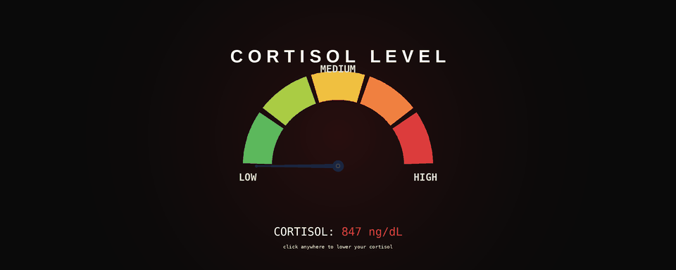

# Bro Chill — stress-induced intervention system

> Local cortisol monitoring for the terminally online developer.

Bro Chill watches how you use your computer and stages an intervention when you start losing it. It detects rage-typing, undo storms, mouse slamming, and crashing applications, then takes over your screen with a fake medical-grade cortisol gauge informing you that your levels are unsafe.

It is not a real medical device. The cortisol values displayed are vibes-based.



---

## Status

Bro Chill is in active early development. Shipping incrementally.

| Feature | Status |
|---|---|
| Keystroke rage detection (sustained + same-key burst) | ✅ Working |
| Cortisol gauge overlay (hero bit) | ✅ Working |
| Undo storm detection | 🚧 Planned |
| Mouse slam detection | 🚧 Planned |
| App crash detection | 🚧 Planned |
| `bc run <cmd>` failed-build wrapper | 🚧 Planned |
| Bit pool (target: 12 bits) | 🚧 1/12 |
| Sound effects | 🚧 Planned |
| Cross-platform support | ❌ Windows-only |

---

## Install

Bro Chill is distributed via clone-and-run. There is no installer, no signed binary, no auto-updater, no telemetry. You can read every line of code before running it.

Requires: Windows 10/11, Python 3.11+, Node.js 18+.

```bash
git clone https://github.com/printomar/bro-chill.git
cd bro-chill

# Python side
python -m venv .venv
.venv\Scripts\activate
pip install -r requirements.txt

# Electron side
cd electron
npm install
cd ..

# Run
.venv\Scripts\python.exe cortisolguard.py
```

You should see `Bro Chill armed.` in the terminal. Mash your keyboard to confirm the overlay fires.

To stop: `Ctrl+C` in the terminal. If that hangs, run `kill.bat`.

---

## Windows Defender note

Bro Chill uses a global keyboard hook (the same Windows API that keyloggers use) to measure typing intensity. It does not record what you type, transmit anything, or write keystrokes to disk. You can verify this in `detectors/keyboard.py` — it's about 80 lines.

That said, Windows Defender sometimes flags the behavior pattern. If you hit issues:

1. Open Windows Security → Virus & threat protection → Exclusions
2. Add an exclusion for the Bro Chill project folder

This is the cost of distributing as an unsigned local script. We are not paying $300/year for an EV cert for a shitpost.

---

## How it works

```
┌──────────────────┐         ┌────────────────────┐
│  Python brain    │         │   Electron face    │
│                  │         │                    │
│  detectors/      │         │  main.js           │
│   ├ keyboard.py  │  HTTP   │   ├ HTTP server    │
│   ├ mouse.py     │ ──────► │   │  :8765         │
│   ├ undo.py      │ POST    │   │                │
│   └ crash.py     │/trigger │   └ BrowserWindow  │
│                  │         │      (fullscreen)  │
│  cortisolguard   │         │                    │
│   .py (entry)    │         │  renderer/         │
└──────────────────┘         │   └ <bit>.html     │
                             └────────────────────┘
```

Python watches OS-level events and fires `RageEvent`s when behavior crosses configured thresholds. Each `RageEvent` triggers an HTTP POST to a small server inside the persistent Electron app. Electron loads the matching bit (an HTML file) into a transparent fullscreen window. Click anywhere to dismiss.

That's the entire program. There is no database, no account, no settings panel, no analytics.

---

## Configuration

All thresholds live in `config.json`. Tweak to taste.

```json
{
  "overlay": {
    "port": 8765,
    "enabled": true
  },
  "keyboard": {
    "velocity_threshold": 9,
    "velocity_window_seconds": 3,
    "burst_threshold": 5,
    "burst_window_seconds": 1,
    "cooldown_seconds": 10
  }
}
```

If the overlay fires too often, raise the thresholds. If it never fires, lower them. Restart Bro Chill to apply changes.

---

## The bits

Each "bit" is a standalone HTML file in `electron/renderer/` registered in `bits/bits.json`. Currently shipping with:

- **`cortisol_spike`** — the hero. Animated gauge slamming to HIGH.

<!-- TODO: more bits as they ship. Screenshots in docs/bits/ -->

Planned for v1:
- `bsod` — fake Windows blue screen diagnosing the developer
- `manager_notified` — Slack-style toast: "Your manager has been notified."
- `breathing_exercise` — ironic breathing circle that pulses too fast
- `linkedin_view` — "Sundar Pichai viewed your profile."
- `therapist_typing` — fake message bubble: "your therapist is typing..."
- `calendar_invite` — meeting invite from yourself, 5 minutes ago, titled "Touch Grass"
- `production_incident` — full-screen alert: "Production incident detected: you."

(Subject to change. Some bits will be cut for being too unfunny.)

---

## FAQ

**Is this a keylogger?**
Spiritually, yes. Functionally, no — it counts keypresses, it does not record them. Read `detectors/keyboard.py` to verify.

**Will this make me a better developer?**
No.

**Will this make me a worse developer?**
Possibly.

**Why is there no Mac/Linux support?**
v1 is Windows-only because that's where the author works. PRs welcome once v1 ships.

**Is the cortisol value real?**
No. It is always 847 ng/dL. This is medically impossible.

**Can I add my own bits?**
Not yet. The bit-loading system is currently hardcoded. A pluggable bit system is on the roadmap if there's demand.

**It quarantined my repo, am I infected?**
No. See the [Windows Defender note](#windows-defender-note) above.

**It says my cortisol is 847 ng/dL. Should I see a doctor?**
Probably, but not because of this.

---

## Known quirks (not bugs)

- The keystroke detector catches you mashing Ctrl+C to quit Bro Chill. This is a feature.
- The Electron overlay flickers occasionally on first show. Acceptable.
- The progress bar on the BSOD bit never reaches 100%. Working as intended.

---

## License

MIT. Do whatever. If you ship a fork, please don't make it a real wellness product.

---

## Credits

Built by [@printomar](https://github.com/printomar)  Instagram [@omarbuilds.ai](https://instagram.com/omarbuilds.ai).

If Bro Chill made you laugh, a ⭐ would lower my cortisol.